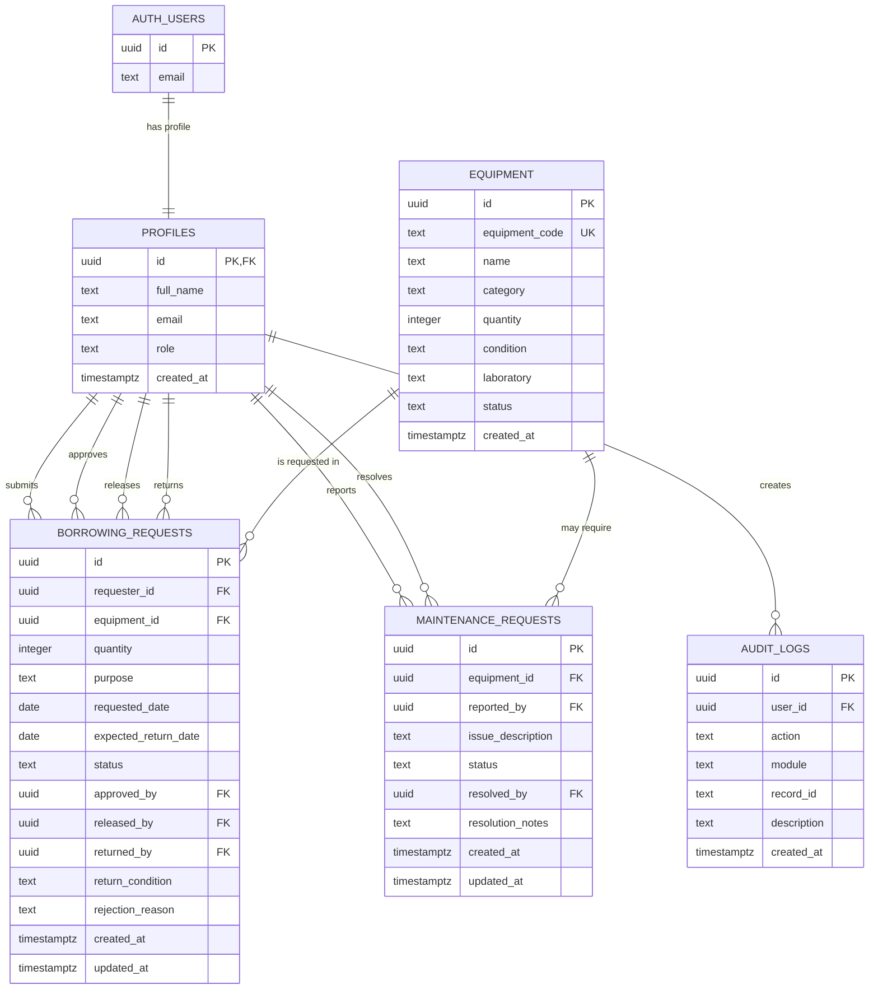
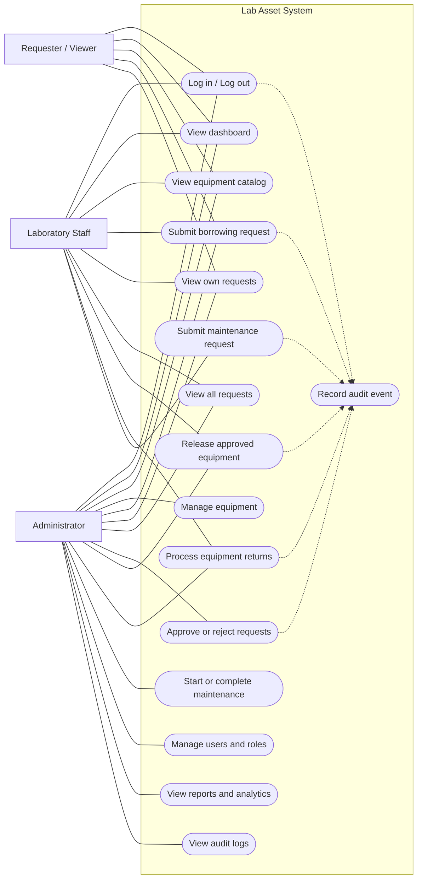
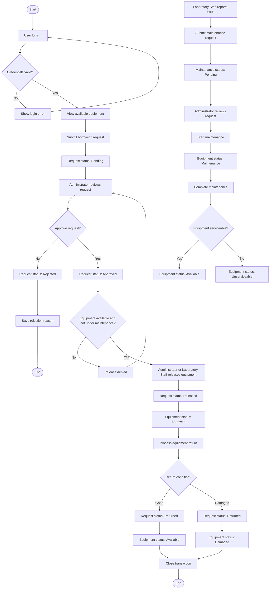
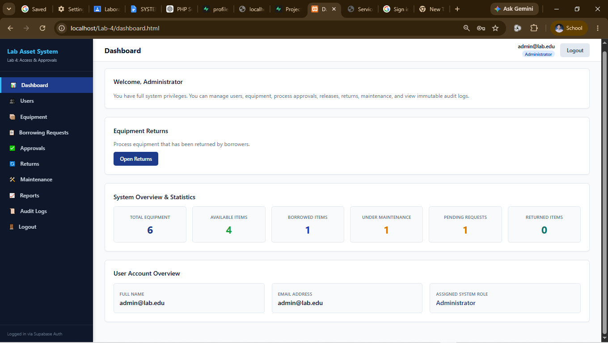

# Lab Asset System Documentation

## 1. Updated ERD and Use Case Diagram

### 1.1 Entity Relationship Diagram

The system uses Supabase Authentication together with five main application entities: user profiles, equipment, borrowing requests, maintenance requests, and audit logs.



### 1.2 Use Case Diagram



## 2. Role-Permission Matrix

| Function / Permission | Administrator | Laboratory Staff | Requester / Viewer |
|---|:---:|:---:|:---:|
| Log in and log out | Yes | Yes | Yes |
| View dashboard | Full metrics | Operational view | Personal history |
| View equipment catalog | Yes | Yes | Yes |
| Create, update, and delete equipment | Yes | No | No |
| Submit borrowing request | Yes | Yes | Yes |
| View own requests | Yes | Yes | Yes |
| View all requests | Yes | Yes | No |
| Approve borrowing requests | Yes | No | No |
| Reject borrowing requests | Yes | No | No |
| Release approved equipment | Yes | Yes | No |
| Process equipment returns | Yes | Yes | No |
| Submit maintenance request | No in secure RPC; see note | Yes | No |
| Start or complete maintenance | Yes | No | No |
| Manage users and assign roles | Yes | No | No |
| View reports and analytics | Yes | No | No |
| View audit logs | Yes | No | No |
| Generate audit events | Automatic | Automatic | Automatic |

**Implementation note:** The database secure RPC permits Laboratory Staff and Administrators to release equipment and process returns. The current frontend helper `canRelease()` restricts release to Administrators, so that helper should be reconciled with the database and displayed system behavior. The secure maintenance submission RPC permits Laboratory Staff only; Administrators manage maintenance after submission.

## 3. Workflow Diagram



Primary borrowing lifecycle:

```text
Pending -> Approved or Rejected -> Released -> Returned -> Closed
```

Equipment lifecycle:

```text
Available -> Borrowed -> Available
Available -> Borrowed -> Damaged
Available -> Maintenance -> Available or Unserviceable
```

## 4. Business Rules

| Rule ID | Business Rule |
|---|---|
| BR-A4-01 | Only equipment with `Available` status may be requested. |
| BR-A4-02 | Administrators and Laboratory Staff cannot approve their own borrowing requests. |
| BR-A4-03 | Only Administrators may approve or reject borrowing requests. |
| BR-A4-04 | Only borrowing requests with `Approved` status may be released. |
| BR-A4-05 | Releasing equipment changes its status to `Borrowed`. |
| BR-A4-06 | Returned equipment becomes `Available` when its return condition is `Good`. |
| BR-A4-07 | Returned equipment becomes `Damaged` when its return condition is `Damaged`. |
| BR-A4-08 | Rejected borrowing requests cannot be released. |
| BR-A4-09 | Equipment under `Maintenance` cannot be requested or released. |
| BR-A4-10 | Returned or closed transactions cannot be processed again. |
| BR-A4-11 | Only Administrators may manage users and assign roles. |
| BR-A4-12 | Only Administrators may create, update, or delete equipment. |
| BR-A4-13 | Administrators and Laboratory Staff may process equipment returns. |
| BR-A4-14 | Laboratory Staff may submit maintenance requests. |
| BR-A4-15 | Only Administrators may start or complete maintenance. |
| BR-A4-16 | Sensitive actions must be recorded in the immutable audit log. |
| BR-A4-17 | Requesters may view only their own borrowing requests. |
| BR-A4-18 | Administrators and Laboratory Staff may view all borrowing requests. |

## 5. Audit-Log Screenshot

The audit-log screen is restricted to Administrators and records authentication, borrowing, maintenance, and other security-sensitive actions. The captured log shows events including `RELEASED`, maintenance updates, `MAINTENANCE_REQUESTED`, `REJECTED`, `APPROVED`, and `LOGOUT`.


### Evidence observed in the screenshot

- The page is labeled **Audit Trail & Security Logs**.
- The screen identifies the audit trail as Administrator-only and immutable.
- Each record displays timestamp, user, action, module, record ID, and description.
- A borrowing release is recorded with the `RELEASED` action.
- Maintenance activity is recorded through update and `MAINTENANCE_REQUESTED` events.
- Approval, rejection, and logout activity are also visible.

## 6. Functional Test Results

The following results are based on the captured application screenshots and the implemented role-based workflow. The screenshots provide evidence for the tests marked **Pass (Evidence)**. Tests that require an additional negative-path interaction are listed as **Pending execution** rather than being claimed as completed.

| Test ID | Feature Tested | Expected Result | Result | Evidence |
|---|---|---|---|---|
| FT-001 | Administrator dashboard | Administrator sees dashboard metrics and administrative navigation | Pass (Evidence) | Dashboard screenshot |
| FT-002 | Equipment statistics | Dashboard displays total, available, borrowed, and maintenance equipment counts | Pass (Evidence) | Dashboard screenshot |
| FT-003 | Approval queue | Administrator can view pending borrowing requests | Pass (Evidence) | Approvals screenshot |
| FT-004 | Approve request | Pending request can be approved by an Administrator | Pass (Evidence) | Approvals screenshot shows Approve action |
| FT-005 | Reject request | Pending request can be rejected by an Administrator | Pass (Evidence) | Approvals screenshot shows Reject action and rejected record |
| FT-006 | Release validation | Pending requests cannot be released; rejected requests cannot be released | Pass (Evidence) | Borrowing screenshot shows rule messages |
| FT-007 | Equipment release | Approved request becomes Released and can proceed to return | Pass (Evidence) | Borrowing screenshot shows Released record |
| FT-008 | Return queue | Released equipment appears in the return queue | Pass (Evidence) | Returns screenshot |
| FT-009 | Return processing rule | Good returns become Available and Damaged returns become Damaged | Pass (Evidence) | Returns page rule text |
| FT-010 | Audit logging | Security-sensitive actions appear in the audit log | Pass (Evidence) | Audit-log screenshot |
| FT-011 | Role-based navigation | Administrator sees Users, Approvals, Reports, and Audit Logs | Pass (Evidence) | Dashboard screenshot |
| FT-012 | Requester access restriction | Requester cannot access administrator-only features | Pending execution | Requires requester session |
| FT-013 | Staff return permission | Laboratory Staff can process returns | Pending execution | Requires staff session |
| FT-014 | Maintenance workflow | Staff submits maintenance request and Administrator manages it | Pass (Evidence) | Audit-log screenshot shows maintenance events |
| FT-015 | Duplicate return prevention | Already returned or closed transaction cannot be returned twice | Pending execution | Requires repeat return attempt |
| FT-016 | Login validation | Invalid credentials are rejected and valid credentials open the system | Pending execution | Requires login test execution |

### Screenshot Evidence

#### Administrator Dashboard



#### Borrowing Approvals


#### Borrowing Transactions and Equipment Release


#### Equipment Returns Processing


### Functional Test Summary

| Result Category | Count |
|---|---:|
| Pass (Evidence) | 11 |
| Pending execution | 5 |
| Total documented tests | 16 |

The evidence confirms the main administrator workflow: reviewing requests, approving or rejecting requests, releasing approved equipment, processing returns, and recording activity in the audit log. The pending tests require separate sessions or repeated actions to verify requester restrictions, staff permissions, invalid login handling, and duplicate-return prevention.
